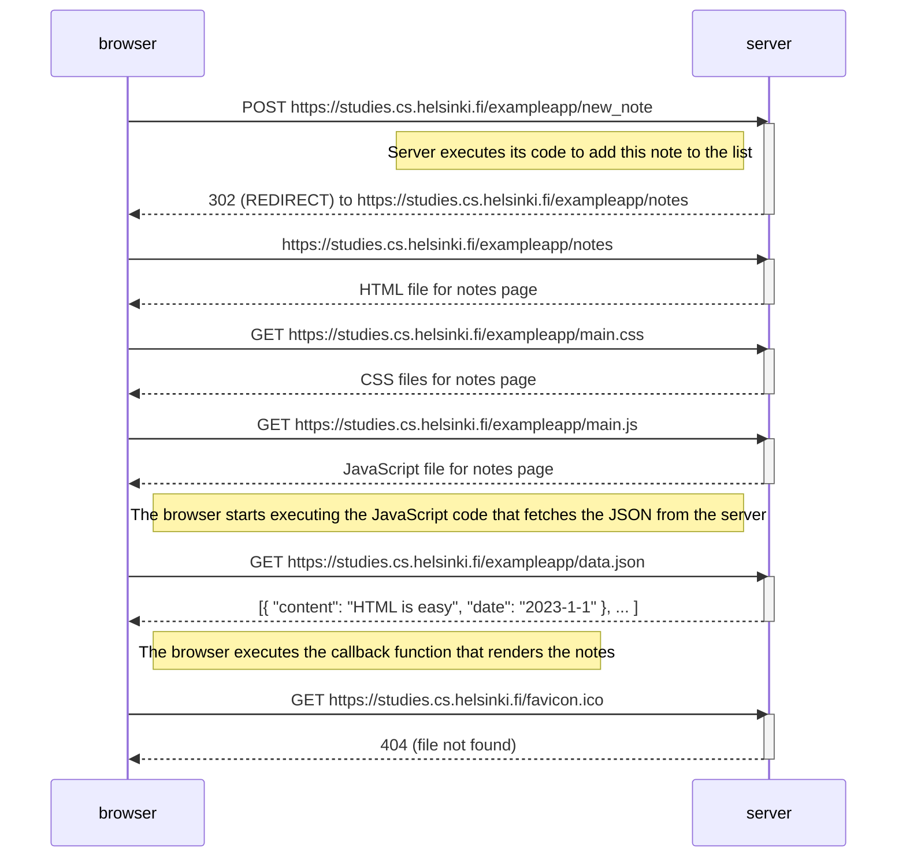

```mermaid
sequenceDiagram
    participant browser
    participant server

    browser->>server: POST https://studies.cs.helsinki.fi/exampleapp/new_note
    activate server
    Note left of server: Server executes its code to add this note to the list
    server-->>browser: 302 (REDIRECT) to  https://studies.cs.helsinki.fi/exampleapp/notes
    deactivate server

    browser->>server: https://studies.cs.helsinki.fi/exampleapp/notes
    activate server
    server-->>browser: HTML file for notes page
    deactivate server

    browser->>server: GET https://studies.cs.helsinki.fi/exampleapp/main.css
    activate server
    server-->>browser: CSS files for notes page
    deactivate server

    browser->>server: GET https://studies.cs.helsinki.fi/exampleapp/main.js
    activate server
    server-->>browser: JavaScript file for notes page
    deactivate server

    Note right of browser: The browser starts executing the JavaScript code that fetches the JSON from the server

    browser->>server: GET https://studies.cs.helsinki.fi/exampleapp/data.json
    activate server
    server-->>browser: [{ "content": "HTML is easy", "date": "2023-1-1" }, ... ]
    deactivate server
	
	Note right of browser: The browser executes the callback function that renders the notes
	
	browser->>server: GET https://studies.cs.helsinki.fi/favicon.ico
    activate server
    server-->>browser: 404 (file not found)
    deactivate server
```